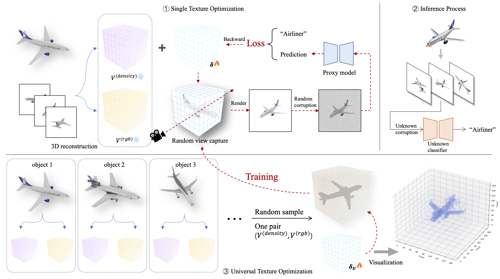

# [You Always Recognize Me(YARM): Robust Texture Synthesis Against Multi-View Corruption](https://openreview.net/pdf?id=nLW7e7KjN0)
This is the official repository of **YARM**

> **You Always Recognize Me(YARM): Robust Texture Synthesis Against Multi-View Corruption**<br>
> Weihang Ran<sup>1</sup>, Wei Yuan<sup>2</sup>, Yinqiang Zheng<sup>1</sup><br>
> <sup>1</sup>The University of Tokyo, <sup>2</sup>Tohoku University

>**Abstract** <br>
> Damage to imaging systems and complex external environments often introduce corruptions, which can impair the performance of deep learning models pretrained on high-quality image data. Previous methods have focused on restoring degraded images or fine-tuning models to adapt to outof-distribution data. However, these approaches struggle with complex, unknown corruptions and often reduce model accuracy on high-quality data. Inspired by the use of warning colors and camouflage in the real world, we propose designing a robust appearance that can enhance model recognition of low-quality image data. Furthermore,
we demonstrate that certain universal features in radiance fields can be applied across objects of the same class with different geometries. We also examine the impact of different proxy models on the transferability of robust appearances. Extensive experiments demonstrate the effectiveness of our proposed method, which outperforms existing image restoration and model fine-tuning approaches across different experimental settings, and retains effectiveness when transferred to models with different architectures.


</br>

## Data Preparation
The IM3D dataset can be downloaded from the [VIAT repository](https://github.com/Heathcliff-saku/VIAT).
Use the following script to convert the format of camera pose

    python preprocess_data.py --path /Path/To/IM3D/Dataset/

The processed data will be organized in ./data/ as following structure:
```
|-- data
    |-- airliner_01
        |-- train
            |-- 000000.png
            |-- 000001.png
            |-- ...
        |-- val
        |-- test
        |-- train_camera_params.json
        |-- val_camera_params.json
        |-- test_camera_params.json
    |-- airliner_02
    |-- ...
```

## Installation
    conda create --name yarm python=3.10.10 --yes
    conda activate yarm
    pip install -r requirements.txt

## Demo (Train robust texture for a single object)
### 1. Train a voxel representation

    bash run_scripts/train_clean_voxel.sh demo_airplane

### 2. Train robust texture

    bash run_scripts/synthesize_robust_texture.sh demo_airplane resnet18 404

Classifier can be chosen from ["renset18", "vgg16"]. For the corresponding groundtruth index, please look into [This file](object_label.json)

## Train universal texture for multiple objects under a same category
To do this, you need to prepare and preprocess IM3D dataset. Here we take "airliner" objects in IM3D as an example.
### 1. Train voxel representation for each object

    bash run_scripts/train_clean_voxel.sh airliner_01

Replace "airliner_01" to ["airliner_02", "airliner_03", ..., "airliner_10"] to learn for each object.

### 2. Train universal robust

    bash run_scripts/synthesize_universal_tex.sh airliner resnet18 404

The universal texture will be trained on airliner_01 to airliner_09 and tested on airliner_10.

## Citation
```
@inproceedings{ranyou,
  title={You Always Recognize Me (YARM): Robust Texture Synthesis Against Multi-View Corruption},
  author={Ran, Weihang and Yuan, Wei and Zheng, Yinqiang},
  booktitle={Forty-second International Conference on Machine Learning}
}
```


## Acknowledgements
We would like to thank the maintainers of the following repositories.
- [Vox-E](https://github.com/TAU-VAILab/Vox-E)
- [Unadversarial Examples](https://github.com/microsoft/unadversarial)
